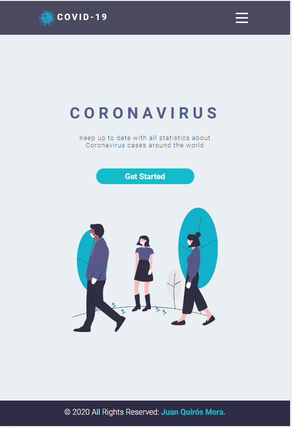
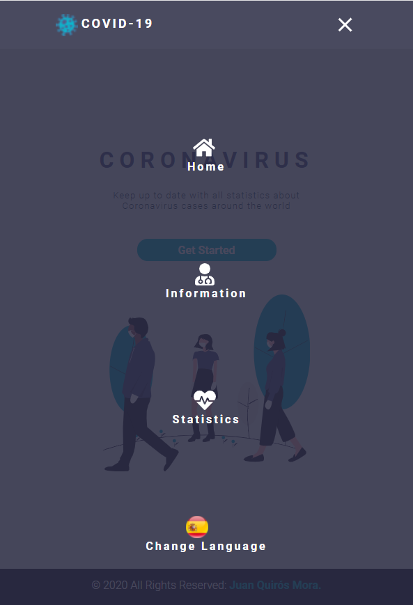

This project was bootstrapped with [Create React App](https://github.com/facebook/create-react-app).

## What you need to use this app

In the project directory, you can run:

### `npm install`
This will install all dependencies needed in this project.

### `npm start`
Runs the app in the development mode. 
Open [http://localhost:3000](http://localhost:3000) to view it in the browser.

### `Home Page View ` 

### `Statistics Page View ` 

### `Menu View ` 

